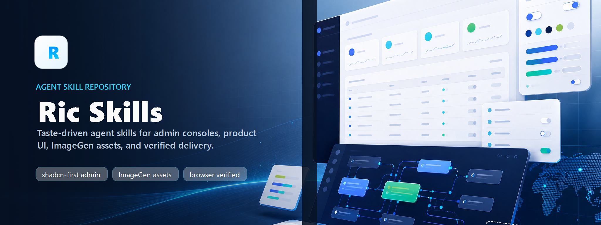
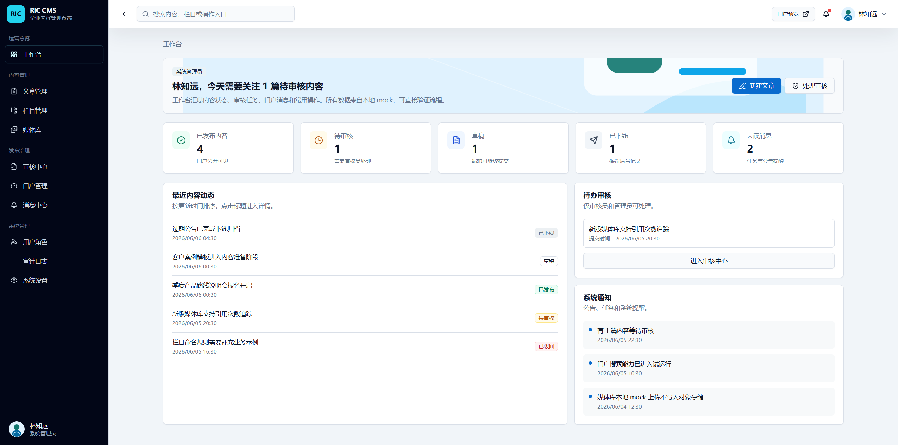

# RIC Skills



RIC Skills is a personal Agent Skills repository based on [Leonxlnx/taste-skill](https://github.com/Leonxlnx/taste-skill), customized for RIC workflows, Chinese enterprise admin-console design, shadcn-first React admin builds, Windows/PowerShell execution, pnpm/FNM Node projects, shared infrastructure safety, ImageGen-backed brand assets, and browser screenshot validation loops.

It keeps the upstream taste-skill design capabilities, renames them into `ric-*` install names, and adds RIC-native engineering skills for admin systems, infrastructure, backend services, data pipelines, API design, testing, code review, deployment, and documentation.



## Attribution

This project is derived from `Leonxlnx/taste-skill`, licensed under MIT. See [NOTICE.md](NOTICE.md) and [LICENSE](LICENSE).

## Installing

Install all skills:

```powershell
npx skills add https://github.com/lichong-a/ric-skills
```

Install one skill by install name:

```powershell
npx skills add https://github.com/lichong-a/ric-skills --skill "ric-admin-console"
npx skills add https://github.com/lichong-a/ric-skills --skill "ric-design-taste-frontend"
```

The install name is the `name:` field in each `SKILL.md`, not necessarily the folder name.

## Recommended Entry Points

| Task | Skill |
| --- | --- |
| Chinese enterprise admin panel, CRUD console, SaaS back office, RBAC, data table, workflow, audit, dashboard, branded login, workbench, user-facing portal attached to an admin system | `ric-admin-console` |
| Public landing page, portfolio, marketing page, public visual redesign | `ric-design-taste-frontend` |
| Screenshot or generated design reference that must be analyzed and implemented | `ric-image-to-code` |
| Shared infrastructure, Redis, Kafka, TimescaleDB/PostgreSQL, Elasticsearch, NATS, MinIO, secrets, namespaces | `ric-infra-safety` |
| Node/FNM/pnpm workflows | `ric-node-pnpm` |
| Complete no-placeholder artifact generation | `ric-full-output-enforcement` |

`ric-admin-console` is the single entry point for backend management systems. It includes admin-adapted visual taste from `ric-design-taste-frontend`, including branded first screens, ImageGen assets, controlled GSAP/3D usage, and portal-grade visual impact where the page is user-facing.

## Admin Console Capability Matrix

| Capability | Default behavior |
| --- | --- |
| Planning questions | Records or asks about multilingual support, theme switching, layout mode, system title, LOGO style, RBAC, menu management, SSO, tenant/data permissions, and public portal scope. |
| Layouts | Supports `sidebar-only`, `topnav-only`, and `sidebar-with-topbar` with fixed shell regions, grouped menus, profile dropdown, and actionable breadcrumbs. |
| React stack | New React admin projects are shadcn-first: React + Vite/Next + shadcn/ui + Tailwind + Radix primitives + TanStack Table. Ant Design is a user-selected or existing-project fallback. |
| Vue stacks | Element Plus, Naive UI, and Arco are supported through framework detection and matching skill/API lookup. |
| Multilingual UI | Supports i18n-ready or implemented language switching across Next.js, React/Vite, Vue 3, Nuxt, Angular, and SvelteKit patterns. |
| Theme switching | Supports light, dark, or `light/dark/system` through tokens/providers, with assets and components verified in each theme. |
| Brand assets | Uses existing assets or active ImageGen/RIC CLI fallback for LOGO, app icon, default avatar, backgrounds, empty states, module visuals, and report/announcement art. |
| Visual impact | Utility pages stay efficient; login, workbench, module homepage, public portal, command center, onboarding, and report cover can use stronger brand expression, GSAP, Three.js/WebGL, 3D cards, or canvas effects when justified. |
| List quality | Enforces one page title, one create action, one `清空选择`, permission-aware `批量删除`, no duplicated toolbar controls, polished scrollbars, and complete loading/empty/error states. |
| Verification | Runnable UI work requires browser screenshots at `1366x768`, `1440x900`, and `1920x1080`, comparison against skill requirements, fixes, and repeated screenshots until passing or blocked. |

## ImageGen Asset Workflow

RIC image-generation skills prefer the environment's agent-native or built-in image capability when available. This includes Codex image generation, MCP image tools, IDE-integrated image tools, or equivalent agent-native generation.

If image tooling is missing or unavailable, RIC skills use the bundled CLI fallback documented in [references/ric-imagegen-fallback.md](references/ric-imagegen-fallback.md). The CLI fallback requires `OPENAI_API_KEY` in the environment. Do not hardcode keys.

Typical admin asset pack for downstream projects:

- App logo or mark variants for sidebar/topbar.
- Default avatar and profile placeholders.
- Empty-state art and onboarding/report/announcement backgrounds.
- Optional generated module icon pack when the user explicitly wants custom small icons.

## Agent Compatibility

Codex is the primary execution environment for this repository, but the skills are written to stay usable in Claude Code, Cursor, Windsurf, Cline, Aider, Antigravity, and other agent environments.

Rules are capability-based:

- Use Codex Browser when available; otherwise use Playwright, Cypress, Puppeteer, IDE browser preview, or another browser automation surface.
- Use agent-native ImageGen when available; otherwise use RIC CLI fallback.
- Use local framework skills when installed; otherwise inspect package versions and official docs before using framework APIs.
- Never claim screenshot validation, image generation, or framework API verification was completed unless it actually ran.

## Validation Loop

For runnable admin UI work, `ric-admin-console` requires:

1. Skill point inventory.
2. Static checks: lint, test, build, typecheck, and framework checks when available.
3. Real browser run.
4. Screenshot matrix across key pages, states, and viewports.
5. Visual comparison against the skill and checklist.
6. Fix loop until screenshots and checks pass.
7. Final evidence: checked pages/states, viewport sizes, issues, fixes, loop count, residual risks.

This loop covers layout, menu, breadcrumbs, loading, list actions, batch delete, modals/drawers, scrollbars, generated assets, theme switching, i18n, and portal/admin separation.

## Skills

### Upstream-Derived Design Skills

| Folder | Install name | Use for |
| --- | --- | --- |
| `ric-design-taste-frontend` | `ric-design-taste-frontend` | Anti-slop landing pages, portfolios, marketing pages, visual redesigns. Routes admin-console work to `ric-admin-console`, including admin pages that need strong brand expression. |
| `ric-design-taste-frontend-v1` | `ric-design-taste-frontend-v1` | Backward-compatible v1 taste-skill behavior with RIC constraints. |
| `ric-gpt-taste` | `ric-gpt-taste` | Stricter premium frontend execution and motion-heavy marketing surfaces. |
| `ric-image-to-code` | `ric-image-to-code` | Image-first design analysis and implementation; admin screenshots route to `ric-admin-console`. |
| `ric-imagegen-frontend-web` | `ric-imagegen-frontend-web` | Website reference images only. |
| `ric-imagegen-frontend-mobile` | `ric-imagegen-frontend-mobile` | Mobile app screen reference images only. |
| `ric-brandkit` | `ric-brandkit` | Brand-kit boards, logo directions, identity systems, palettes, typography, mockups. |
| `ric-redesign-existing-projects` | `ric-redesign-existing-projects` | Redesign existing websites, apps, and admin systems after audit. |
| `ric-high-end-visual-design` | `ric-high-end-visual-design` | Premium visual UI direction with strong anti-generic rules. |
| `ric-full-output-enforcement` | `ric-full-output-enforcement` | Complete output enforcement, no placeholders or omitted files. |
| `ric-minimalist-ui` | `ric-minimalist-ui` | Clean editorial minimal product UI. |
| `ric-industrial-brutalist-ui` | `ric-industrial-brutalist-ui` | Industrial/brutalist/tactical telemetry UI. |
| `ric-stitch-design-taste` | `ric-stitch-design-taste` | Google Stitch-compatible semantic DESIGN.md generation. |

### RIC Native Skills

| Folder | Install name | Use for |
| --- | --- | --- |
| `ric-admin-console` | `ric-admin-console` | Chinese enterprise admin systems, CRUD, permissions, tables, branded login pages, visual workbenches, SaaS console homepages, public portals attached to admin systems, actionable breadcrumbs, skeleton-first loading, multilingual planning, light/dark/system theme switching, RBAC/menu/SSO planning, shadcn-first React stack, optional Ant Design fallback, framework-specific UI skill routing, active ImageGen brand assets, browser screenshot validation loops, list-page quality, detail pages, profile center, workflow, logs, settings. |
| `ric-agent-operating-rules` | `ric-agent-operating-rules` | Baseline agent behavior: skill retrieval, PowerShell, non-destructive work, verification. |
| `ric-infra-safety` | `ric-infra-safety` | Shared infrastructure reuse, ric namespace rules, secrets, non-destructive data operations. |
| `ric-node-pnpm` | `ric-node-pnpm` | Node 24/FNM/pnpm 11 workflows and lockfile hygiene. |
| `ric-backend-service` | `ric-backend-service` | Backend services, workers, health checks, config, auth, logging, shared infrastructure connections. |
| `ric-data-pipeline` | `ric-data-pipeline` | Kafka/NATS/Redis/TimescaleDB/Elasticsearch data pipelines, idempotency, retries, backfills. |
| `ric-api-design` | `ric-api-design` | API contracts, pagination, sorting, errors, permissions, compatibility. |
| `ric-testing-quality` | `ric-testing-quality` | Unit/integration/E2E/visual/static/build verification. |
| `ric-code-review` | `ric-code-review` | Review diffs for bugs, regressions, safety, permissions, missing tests. |
| `ric-deployment-ops` | `ric-deployment-ops` | Build, release, config, health checks, rollback, CI/CD, ops readiness. |
| `ric-docs` | `ric-docs` | README, runbooks, API docs, admin docs, changelogs, handoff notes. |

## Local Registry

PowerShell:

```powershell
.\skill.ps1 ric-admin-console
.\skill.ps1 ric-design-taste-frontend
```

Bash:

```bash
./skill.sh ric-admin-console
./skill.sh ric-design-taste-frontend
```

## Development Notes

- Keep `SKILL.md` frontmatter to `name` and `description`.
- Keep install names lowercase and hyphenated.
- Preserve upstream attribution when updating derived skills.
- Validate skill frontmatter after edits.
- Prefer detailed execution protocols over vague "best practice" advice.
