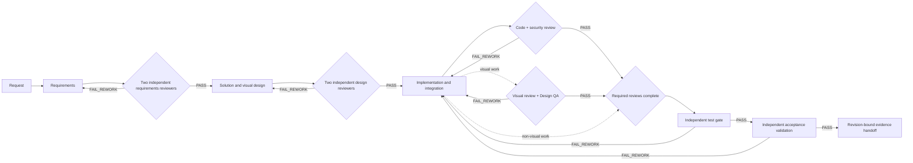

# RIC Skills


RIC Skills is a taste-driven, evidence-backed Agent Skills repository derived from [Leonxlnx/taste-skill](https://github.com/Leonxlnx/taste-skill). It combines product and visual design, Chinese enterprise admin-console implementation, backend/data/API engineering, independent review, testing, acceptance validation, ImageGen assets, and cross-agent delivery contracts.

For every non-trivial product or engineering delivery, start with **`ric-delivery-loop`**. A task has one active primary executor; independent quality gates review, test, and validate the same final revision. When subagent, isolated-thread, and external-agent independence routes are all unavailable during a complete delivery loop, the run remains `BLOCKED`, never a synthetic PASS.


The banner is a generated repository concept and the CMS workbench is a utility-admin example. Neither image is release evidence. A real delivery passes only with current revision-bound review, test, and acceptance artifacts; visual/Design QA and browser-interaction artifacts are additionally mandatory when the task includes those surfaces.

## Two Operating Paths

Use the complete runtime loop for delivered systems:

```text
requirements -> subagent requirements review -> design -> subagent design review
-> implementation -> subagent code/security/visual review
-> subagent tests -> subagent acceptance validation -> evidence handoff
```

Maintaining this skill repository is intentionally lighter:

```text
read skill-authoring guidance -> edit skill/schema/validator
-> static checks and deterministic evals
-> explicitly invoke ric-skill-quality when final independent behavior evaluation is needed
```

Repository authors may choose the implementation method. They must report which
checks and behavior evals actually ran, but a mechanical skill-repository edit is
not blocked only because no subagent was used during authoring.

## Closed Delivery Loop



Any implementation fix creates a new revision and invalidates old code, security, test, visual, Design QA, and acceptance results. The required return path is:

```text
fix -> code/security re-review -> affected tests -> required full tests
-> affected visual/design QA -> acceptance validation -> evidence handoff
```

## Gate Contract

| Decision | Meaning |
| --- | --- |
| `PASS` | Current revision has complete evidence and no unresolved findings. |
| `PASS_WITH_ADVISORIES` | Only owned, justified, and disposed `S2`/`S3` findings remain. |
| `FAIL_REWORK` | A separate fixer must change the artifact and trigger re-review. |
| `BLOCKED` | Capability, secret, safety rule, environment, or independence prevents proof. |
| `ESCALATE` | Reviewer conflict, exhausted loop budget, major scope change, or risk acceptance needs adjudication. |

Requirements and design use two independent reviewers. Every non-trivial task uses an independent security reviewer. Each gate and run epoch is capped at three rounds; no progress across two fixes triggers an adjudicator.

## Machine Contracts

`skills/catalog.json` is the source of truth for skill roles, companions, conflicts, quality gates, gate-type ownership, capability routes, and generated registries. A passing run must include the primary executor's catalog-declared gates and cannot select conflicting skills.

Runtime evidence is stored under ignored `.ric-work/<run-id>/`:

```text
run.json                 requirements.md
acceptance.json          traceability.json
risk-register.json       design.md
dispatch/*.json          review-results/*.json
adjudication-results/*.json
test-plan.json           test-results/*.json
handoff.md
live-eval-result.json    live-eval-evidence/   # optional behavior eval
```

Minimal selected-skill contract:

```json
{
  "selected_skills": [
    {"name": "ric-delivery-loop", "active_role": "orchestrator"},
    {"name": "ric-admin-console", "active_role": "primary-executor"},
    {"name": "ric-security-review", "active_role": "quality-gate"}
  ]
}
```

Evidence paths must remain inside the run directory, exist, match SHA-256, and bind to the final source revision. All canonical JSON artifacts bind to the same `run_id`. Requirements and design reviews bind to immutable artifact versions; source-bound reviews, tests, and acceptance bind to the final revision. Reworked gates preserve ordered failure, fix, invalidation, and re-pass history. Utility-only admin work does not require high-visual treatment; activating a visual modifier, public portal, login, workbench, redesign, or source-fidelity workflow requires visual review and Design QA.

`scripts/validate-delivery-run.py` rejects invalid schemas, malformed catalog instances (without crashing), invalid catalog roles or companions, unknown capabilities, empty author provenance on passing runs, self-approval, reused gate actors, missing required subagent skills, cross-run artifacts, stale or terminally invalidated gates, non-required gates with terminal failures that coexist with PASS, contradictory duplicate gate results, dangling evidence references, secrets, open `S0/S1`, undisposed `S2`, failed acceptance, missing evidence, test plans with no mandatory suites, mandatory acceptance criteria unmapped to mandatory suites, low visual scores, visual work that omits `visual-review` or `design-qa` (detected from request scope, active visual modifiers, or admin console tasks), over-budget loops, degraded PASS, and non-passing live-eval evidence when a live-eval file is present.

The non-cryptographic strengthening model prevents accidental forgeries and honest mistakes through invocation receipts, loaded-skill binding, typed evidence, content-hash artifact versions, and mandatory-suite enforcement. It does not claim to prevent a malicious actor who controls the entire run package, all artifacts, and the validator from forging results. True prevention of that threat requires external CI enforcement, branch protection, and CODEOWNER review.

## Visual And Behavioral Evidence

Screenshots prove appearance only. Browser actions, assertions, traces, and acceptance evidence prove behavior.

- Visual reviewer: independent quality, product fit, hierarchy, brand expression, and distinctiveness.
- Design QA reviewer: approved source versus rendered implementation at matching states and viewports.
- Interaction validator: breadcrumb navigation, permissions, state restoration, forms, loading, responsive behavior, and accessibility.
- Advanced motion/WebGL: video or motion trace, performance profile, reduced-motion evidence, and nonblank canvas/WebGL assertion.
- Public portal, login, invite, registration, tenant welcome, and immersive workbench: at least one mobile viewport is mandatory.

## Agent And Capability Routing

Codex is the primary environment, but contracts are capability-based and portable to Claude Code, Cursor, Windsurf, Cline, Aider, isolated threads, external agents, and CI workers.

| Capability | Preferred use | Fallback |
| --- | --- | --- |
| Subagents | independent review, tests, validation | isolated thread, external agent; otherwise `BLOCKED` |
| Creative Production | logo, moodboard, three visual directions, ImageGen direction board | local visual skills and approved ImageGen runtime |
| Product Design | flows, prototypes, product critique, design-source review | domain design contract and independent Design QA |
| Build Web Data Visualization | dashboards, maps, charts, command centers, data narratives | existing framework/chart stack with explicit metric semantics |
| Codex Security | threat model, diff scan, finding validation | `ric-security-review` plus reproducible security evidence |
| OpenAI Developers / Agents SDK | agentic app guidance or a user-supplied live-eval program | connect it through the external-command live-eval adapter |
| Browser automation | real interaction and screenshot evidence | Playwright/Cypress/Puppeteer/IDE browser; otherwise `BLOCKED` |
| ImageGen | agent-native/MCP/IDE image tool | trusted canonical CLI fallback; missing credentials means `BLOCKED` |

## Recommended Entry Points

| Task | Entry |
| --- | --- |
| Non-trivial end-to-end delivery | `ric-delivery-loop` |
| Chinese enterprise admin, SaaS back office, CRUD, RBAC, workbench, attached portal | `ric-admin-console` |
| Public landing page, portfolio, product marketing, visual frontend | `ric-design-taste-frontend` |
| Backend service or worker | `ric-backend-service` |
| Event/data pipeline, DLQ, replay, backfill | `ric-data-pipeline` |
| Review-only request | `ric-code-review`, `ric-security-review`, or another quality gate directly |
| Skill repository change | Edit and run repository checks directly; explicitly invoke `ric-skill-quality` for final independent behavior evaluation; optionally retrieve `writing-skills` for RED-GREEN-REFACTOR guidance |

## Admin Console

`ric-admin-console` remains the single admin-product primary entry. It is shadcn-first for new React admin systems, preserves established UI stacks, actively retrieves framework skills, plans i18n/theme/layout/title/logo/RBAC/menu/SSO, uses ImageGen assets where appropriate, and keeps utility CRUD pages efficient while allowing stronger portal/login/workbench visuals. It separately validates screenshot quality and real interactions.

## Install

```powershell
npx skills add https://github.com/lichong-a/ric-skills
npx skills add https://github.com/lichong-a/ric-skills --skill "ric-delivery-loop"
```

Local lookup:

```powershell
.\skill.ps1 ric-delivery-loop
.\skill.ps1 ric-admin-console
```

## Skills

<!-- BEGIN GENERATED SKILLS -->

| Install name | Default role | Trigger |
| --- | --- | --- |
| `ric-acceptance-validation` | quality-gate | Use when a tested integrated revision must be independently validated against approved acceptance criteria before final delivery or release readiness. |
| `ric-admin-console` | primary-executor | Use when creating or changing admin panels, SaaS back offices, CRUD consoles, RBAC systems, data-heavy dashboards, branded management workbenches, or public surfaces attached to an admin product. |
| `ric-agent-operating-rules` | policy | Use when performing any task in a RIC workspace or when repository work must preserve user changes, follow the configured Windows runtime, and apply RIC safety constraints. |
| `ric-api-design` | modifier | Use when creating or changing REST, RPC, event, webhook, OpenAPI, request-response, pagination, error, authorization, or compatibility contracts between systems. |
| `ric-backend-service` | primary-executor | Use when creating or changing API servers, backend services, workers, scheduled jobs, integrations, persistence logic, service lifecycle, or runtime observability. |
| `ric-brandkit` | modifier | Use when generating or refining a visual identity system, logo direction, brand board, palette, typography direction, image language, or branded application concepts. |
| `ric-code-review` | quality-gate | Use when an implementation, diff, pull request, migration, configuration change, test change, or documentation change requires an independent correctness and risk decision. |
| `ric-data-pipeline` | primary-executor | Use when designing or changing event streams, ingestion, projections, indexing, analytics flows, consumers, retries, dead-letter handling, replay, reconciliation, or backfills. |
| `ric-delivery-loop` | orchestrator | Use when delivering a non-trivial feature, fix, redesign, migration, or system change that requires coordinated requirements, design, implementation, review, testing, validation, and evidence. |
| `ric-deployment-ops` | handoff | Use when a verified change must be packaged, released, rolled out, monitored, rolled back, or assessed for production readiness through CI/CD or runtime operations. |
| `ric-design-qa` | quality-gate | Use when a rendered UI or generated asset implementation must be compared with an approved design, screenshot, reference image, direction board, or source-of-truth visual target. |
| `ric-design-taste-frontend` | primary-executor | Use when creating or substantially redesigning public-facing websites, landing pages, portfolios, product marketing surfaces, or branded frontend experiences where visual direction, interaction craft, and anti-template quality materially affect the outcome. |
| `ric-design-taste-frontend-v1` | modifier | Use when an existing visual direction explicitly depends on the legacy taste-skill v1 language and needs a bounded compatibility modifier. |
| `ric-docs` | handoff | Use when changed behavior, contracts, configuration, architecture, operations, setup, release procedures, or user workflows require accurate documentation or handoff material. |
| `ric-full-output-enforcement` | modifier | Use when a requested implementation or artifact must be complete and partial snippets, placeholders, omitted files, or user-side assembly would make delivery unusable. |
| `ric-gpt-taste` | modifier | Use when a public-facing visual surface needs a premium, motion-aware direction and the primary executor needs a bounded style modifier. |
| `ric-high-end-visual-design` | modifier | Use when an approved product or public-facing surface needs a premium visual direction with stronger hierarchy, typography, imagery, and interaction craft. |
| `ric-image-to-code` | primary-executor | Use when implementing or redesigning a frontend from screenshots, mockups, generated references, design exports, or other visual sources where source-to-render fidelity is a primary acceptance criterion. |
| `ric-imagegen-frontend-mobile` | modifier | Use when generating mobile app visual directions, screen concepts, flow references, or asset systems for iOS, Android, and cross-platform product experiences. |
| `ric-imagegen-frontend-web` | modifier | Use when generating visual directions, section references, asset concepts, or high-fidelity web comps for landing pages, public product surfaces, portfolios, campaigns, and image-led frontend work. |
| `ric-imagegen-runtime` | runtime | Use when generated or edited raster assets are required in an environment where ImageGen capabilities, providers, credentials, or output paths may vary. |
| `ric-independent-review` | quality-gate | Use when requirements, designs, code, tests, evidence, or release decisions need a read-only fresh-context reviewer who is independent from the artifact author or fixer. |
| `ric-industrial-brutalist-ui` | modifier | Use when an approved interface direction calls for industrial, brutalist, mechanical, Swiss, tactical, or telemetry-oriented visual language. |
| `ric-infra-safety` | policy | Use when work may read or modify databases, migrations, caches, queues, search indices, streams, object storage, shared services, credentials, or infrastructure provisioning. |
| `ric-minimalist-ui` | modifier | Use when an approved product direction calls for restrained, editorial, calm, precise, or utility-focused visual language. |
| `ric-node-pnpm` | policy | Use when a task changes Node.js versions, JavaScript or TypeScript dependencies, package-manager state, workspace scripts, lockfiles, or pnpm monorepo configuration. |
| `ric-redesign-existing-projects` | modifier | Use when an existing website, product, admin console, or application needs a visual or interaction redesign while preserving verified behavior. |
| `ric-requirements-engineering` | lifecycle-stage | Use when a non-trivial request has ambiguous scope, unstated constraints, missing acceptance criteria, competing stakeholder needs, or requires a reviewable requirements baseline. |
| `ric-security-review` | quality-gate | Use when a non-trivial change touches code, data, authentication, authorization, tenants, secrets, dependencies, infrastructure, integrations, deployment, or any user-controlled input. |
| `ric-skill-quality` | quality-gate | Use when creating, editing, reviewing, packaging, or releasing skills and the repository needs structural checks, trigger evaluation, conflict detection, behavioral scenarios, or independent quality evidence. |
| `ric-solution-design` | lifecycle-stage | Use when approved requirements need an implementation-ready product, architecture, data, API, visual, operational, or migration design before coding begins. |
| `ric-stitch-design-taste` | modifier | Use when an approved design direction needs a concise semantic DESIGN.md or Google Stitch-compatible visual guidance artifact. |
| `ric-testing-quality` | quality-gate | Use when changed behavior requires a formal unit, integration, contract, end-to-end, browser, accessibility, security, migration, data, performance, or build verification gate. |
| `ric-visual-design-review` | quality-gate | Use when a UI, portal, admin console, redesign, brand surface, generated asset set, or visual implementation needs an independent critique of quality, specificity, hierarchy, and distinctiveness. |

<!-- END GENERATED SKILLS -->

## Repository Quality

```powershell
$env:PYTHONUTF8='1'
python scripts/generate-registries.py --check
python -m unittest discover -s scripts -p "test_*.py" -v
python scripts/run-deterministic-evals.py
.\scripts\validate-skills.ps1 -WarningsAsErrors
```

`scripts/validate-delivery-run.py --repo <repository> <run-dir>` validates a
completed runtime package and optionally confirms that its final revision equals
the repository `HEAD`.

`scripts/run-live-evals.py` is an optional final behavior-evaluation adapter. It
records actual loaded skills, fresh-context roles, gate evidence, transcript
hashes, and scenario outcomes. If no independent adapter is available, it reports
that the behavior eval was not completed; this does not block ordinary repository
editing, static validation, commits, or releases. External adapters run with an
allowlisted minimal environment, bounded output, evidence-path checks, and timeout
termination.

GitHub branch protection must require the quality workflow and CODEOWNER review for workflows, validators, schemas, catalog, and quality-gate skills. Repository files alone cannot prevent an authorized contributor from changing both a gate and its validator in the same pull request.

## Attribution

Derived from `Leonxlnx/taste-skill` under the MIT License. See [NOTICE.md](NOTICE.md), [LICENSE](LICENSE), and [CHANGELOG.md](CHANGELOG.md).
